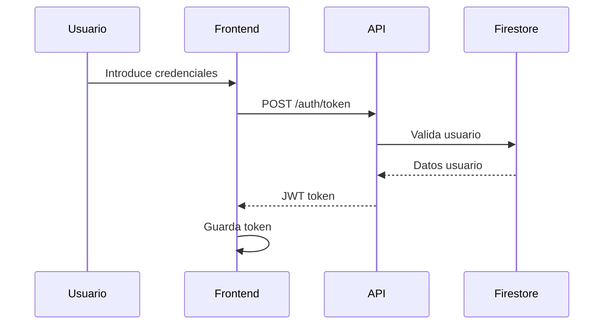
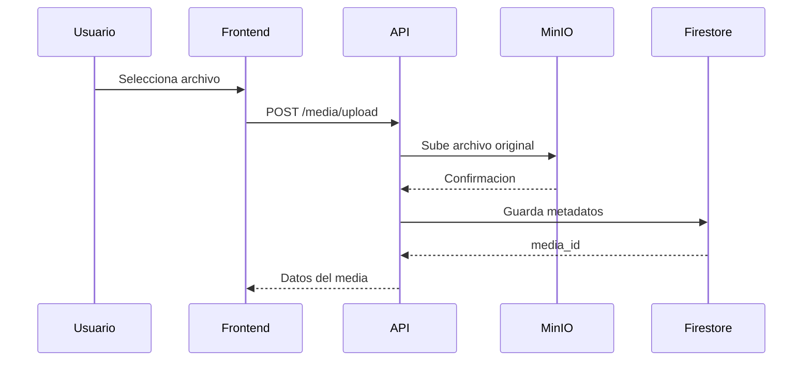
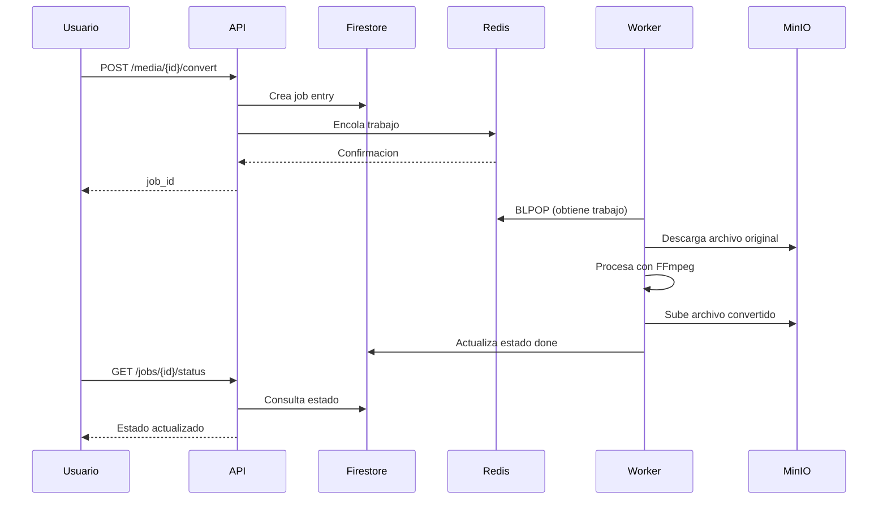

# Espotifai

Sistema distribuido de conversión y streaming de archivos multimedia con autenticación, almacenamiento en la nube y procesamiento asíncrono mediante workers.

## 📋 Índice

- [Descripción](#descripción)
- [Arquitectura](#arquitectura)
- [Tecnologías](#tecnologías)
- [Requisitos Previos](#requisitos-previos)
- [Instalación y Despliegue](#instalación-y-despliegue)
- [Configuración](#configuración)
- [API Reference](#api-reference)
- [Estructura del Proyecto](#estructura-del-proyecto)
- [Flujo de Trabajo](#flujo-de-trabajo)
- [Monitoreo](#monitoreo)

## 📖 Descripción

Espotifai es una plataforma de conversión y streaming de archivos multimedia que permite a los usuarios:

- Registrarse e iniciar sesión (con credenciales locales o Google OAuth)
- Subir archivos de audio y video
- Convertir archivos a diferentes formatos (MP3, MP4, HLS)
- Compartir archivos convertidos con otros usuarios
- Hacer streaming directo de archivos procesados
- Monitorear el estado del sistema y los trabajos de conversión

## 🏗️ Arquitectura

El sistema está basado en una arquitectura de microservicios con los siguientes componentes:

```
┌─────────────┐
│   Frontend  │ (HTML/CSS/JS + Firebase Auth)
└──────┬──────┘
       │ HTTP/REST
       ▼
┌─────────────┐
│   API       │ (FastAPI + Uvicorn)
│   Gateway   │ - Autenticación JWT
└──────┬──────┘ - Gestión de archivos
       │        - Encolado de trabajos
       ├────────────────┬────────────────┐
       ▼                ▼                ▼
┌──────────┐     ┌──────────┐    ┌──────────┐
│  Redis   │     │  MinIO   │    │ Firestore│
│  Queue   │     │  Object  │    │    DB    │
└────┬─────┘     │  Storage │    └──────────┘
     │           └──────────┘
     ▼
┌─────────────────────────────┐
│  Workers (A y B)            │
│  - Procesamiento FFmpeg     │
│  - Subida a MinIO           │
│  - Actualización Firestore  │
└─────────────────────────────┘
```

### Componentes

1. **Frontend**: Interfaz web estática con autenticación Firebase
2. **API Gateway**: Servidor FastAPI que maneja todas las peticiones
3. **Redis**: Cola de mensajes para trabajos de conversión
4. **MinIO**: Almacenamiento de objetos S3-compatible
5. **Firestore**: Base de datos NoSQL para metadatos
6. **Workers**: Procesadores de conversión multimedia (escalables)

## 🛠️ Tecnologías

### Backend
- **FastAPI** 0.115 - Framework web asíncrono
- **Uvicorn** 0.30 - Servidor ASGI
- **Redis** 5.0 - Sistema de colas
- **MinIO** 7.2 - Almacenamiento de objetos
- **Google Cloud Firestore** 2.16 - Base de datos
- **FFmpeg** - Conversión multimedia
- **Prometheus Client** 0.20 - Métricas

### Frontend
- HTML5, CSS3, JavaScript (ES6+)
- Firebase Authentication
- Fetch API para comunicación con backend

### Infraestructura
- **Docker** & **Docker Compose** - Contenedorización
- **Python** 3.11

## 📦 Requisitos Previos

- Docker Desktop (Windows/Mac) o Docker Engine + Docker Compose (Linux)
- Git
- Cuenta de Firebase (para autenticación)
- 4GB RAM mínimo
- 10GB espacio en disco

## 🚀 Instalación y Despliegue

### 1. Clonar el repositorio

```bash
git clone https://github.com/Geancaov/espotifai.git
cd espotifai
```

### 2. Configurar variables de entorno

Crear archivo `backend/.env`:

```env
# Firebase
FIREBASE_PROJECT_ID=tu-proyecto-firebase
GOOGLE_APPLICATION_CREDENTIALS=/app/keys/service-account.json

# JWT
JWT_SECRET_KEY=tu-clave-secreta-muy-segura
JWT_ALGORITHM=HS256

# Redis
REDIS_HOST=redis
REDIS_PORT=6379
REDIS_DB=0
REDIS_QUEUE=convert

# MinIO
MINIO_ENDPOINT=minio:9000
MINIO_ACCESS_KEY=minioadmin
MINIO_SECRET_KEY=minioadmin
MINIO_SECURE=false
```

### 3. Configurar Firebase

1. Crear proyecto en [Firebase Console](https://console.firebase.google.com/)
2. Habilitar Authentication con Google
3. Descargar credenciales de Service Account
4. Guardar como `backend/keys/service-account.json`
5. Actualizar configuración en `frontend/index.html`:

```javascript
const firebaseConfig = {
  apiKey: "TU_API_KEY",
  authDomain: "tu-proyecto.firebaseapp.com",
  projectId: "tu-proyecto",
  storageBucket: "tu-proyecto.firebasestorage.app",
  messagingSenderId: "TU_SENDER_ID",
  appId: "TU_APP_ID"
};
```

### 4. Levantar servicios con Docker Compose

```bash
docker-compose up -d
```

Esto levantará:
- API en `http://localhost:8000`
- MinIO Console en `http://localhost:9001`
- Redis en `localhost:6379`
- Workers (worker_a y worker_b)

### 5. Verificar servicios

```bash
# Ver logs
docker-compose logs -f

# Ver estado
docker-compose ps

# Verificar API
curl http://localhost:8000/metrics
```

### 6. Acceder a la aplicación

Abrir `frontend/index.html` en un navegador o servir con un servidor HTTP:

```bash
# Con Python
cd frontend
python -m http.server 8080

# Acceder en: http://localhost:8080
```

## ⚙️ Configuración

### Configuración de Workers

Los workers se pueden escalar modificando `docker-compose.yml`:

```yaml
worker_c:
  build: ./backend
  container_name: worker_c
  command: python worker/worker.py
  environment:
    - WORKER_ID=worker_c
    - REDIS_QUEUE=convert
    # ... resto de variables
```

### Configuración de MinIO

Acceder a MinIO Console:
- URL: `http://localhost:9001`
- Usuario: `minioadmin`
- Password: `minioadmin`

Buckets creados automáticamente:
- `espotifai-media`: almacenamiento de archivos originales y convertidos

### Configuración de Firestore

Colecciones utilizadas:
- `users`: información de usuarios
- `media`: metadatos de archivos y conversiones

## 📚 API Reference

Base URL: `http://localhost:8000`

### Autenticación

#### Registro de usuario
```http
POST /auth/register
Content-Type: application/x-www-form-urlencoded

username=usuario&password=contraseña
```

**Respuesta:**
```json
{
  "id": "user_id",
  "username": "usuario"
}
```

#### Login
```http
POST /auth/token
Content-Type: application/x-www-form-urlencoded

username=usuario&password=contraseña
```

**Respuesta:**
```json
{
  "access_token": "eyJ0eXAiOiJKV1QiLCJhbGc...",
  "token_type": "bearer"
}
```

#### Login con Google
```http
POST /auth/google
Content-Type: application/json

{
  "id_token": "token_de_firebase"
}
```

#### Obtener usuario actual
```http
GET /me
Authorization: Bearer {token}
```

**Respuesta:**
```json
{
  "id": "user_id",
  "username": "usuario"
}
```

#### Logout
```http
POST /auth/logout
Authorization: Bearer {token}
```

### Gestión de Archivos

#### Subir archivo
```http
POST /media/upload
Authorization: Bearer {token}
Content-Type: multipart/form-data

file: [archivo]
```

**Respuesta:**
```json
{
  "id": "media_id",
  "user_id": "user_id",
  "original_filename": "audio.mp3",
  "source_bucket": "espotifai-media",
  "source_object": "uploads/user_id/media_id/original.mp3",
  "content_type": "audio/mpeg",
  "original_extension": ".mp3",
  "original_size_bytes": 5242880,
  "created_at": "2025-11-18T10:30:00Z",
  "status": "uploaded"
}
```

**Formatos soportados:**
- Audio: `.mp3`, `.wav`, `.flac`, `.ogg`
- Video: `.mp4`, `.mkv`, `.mov`

#### Convertir archivo
```http
POST /media/{media_id}/convert
Authorization: Bearer {token}
Content-Type: application/json

{
  "target": "mp3"  // "mp3" | "mp4" | "hls"
}
```

**Respuesta:**
```json
{
  "media_id": "media_id",
  "job_id": "job_id",
  "status": "enqueued",
  "target": "mp3"
}
```

#### Consultar estado de conversión
```http
GET /jobs/{job_id}/status?media_id={media_id}
Authorization: Bearer {token}
```

**Respuesta:**
```json
{
  "job_id": "job_id",
  "media_id": "media_id",
  "status": "done",  // "enqueued" | "processing" | "done" | "failed"
  "target": "mp3",
  "output_prefix": "converted/media_id/job_id",
  "output_size_bytes": 3145728,
  "enqueued_at": "2025-11-18T10:35:00Z",
  "updated_at": "2025-11-18T10:35:45Z"
}
```

#### Generar URL de descarga
```http
GET /media/{media_id}/share?job_id={job_id}
Authorization: Bearer {token}
```

**Respuesta:**
```json
{
  "url": "http://minio:9000/espotifai-media/converted/...",
  "target": "mp3",
  "job_id": "job_id"
}
```

#### Streaming de archivo
```http
GET /media/{media_id}/stream?job_id={job_id}
```

**Respuesta:** Stream binario (audio/video)

### Compartir Archivos

#### Listar usuarios
```http
GET /users
Authorization: Bearer {token}
```

**Respuesta:**
```json
[
  {
    "id": "user_id",
    "username": "usuario1"
  }
]
```

#### Compartir con usuario
```http
POST /media/{media_id}/share-with-user
Authorization: Bearer {token}
Content-Type: application/json

{
  "username_to_share": "usuario2",
  "job_id": "job_id"
}
```

**Respuesta:**
```json
{
  "detail": "Archivo compartido correctamente",
  "media_id": "media_id",
  "job_id": "job_id",
  "shared_with_user_id": "user_id",
  "username_to_share": "usuario2"
}
```

#### Ver archivos compartidos conmigo
```http
GET /media/shared-with-me
Authorization: Bearer {token}
```

**Respuesta:**
```json
{
  "items": [
    {
      "media_id": "media_id",
      "owner_id": "user_id",
      "original_filename": "audio.mp3",
      "jobs": {...},
      "shared_with": ["user_id"],
      "shares": [...]
    }
  ]
}
```

### Monitoreo

#### Métricas Prometheus
```http
GET /metrics
```

**Respuesta:** Formato Prometheus texto plano

#### Resumen del sistema
```http
GET /monitor/summary
Authorization: Bearer {token}
```

**Respuesta:**
```json
{
  "generated_at": "2025-11-18T10:40:00Z",
  "api": {
    "status": "online",
    "cpu_percent": 15.2,
    "memory_percent": 42.5
  },
  "queue": {
    "name": "convert",
    "length": 3
  },
  "sessions": {
    "current_user": {
      "id": "user_id",
      "username": "usuario"
    },
    "active_sessions_estimate": 1,
    "total_users": 10
  },
  "nodes": [
    {"id": "api", "role": "API / gateway", "status": "online"},
    {"id": "worker_a", "role": "worker de conversión", "status": "online"},
    {"id": "worker_b", "role": "worker de conversión", "status": "online"}
  ]
}
```

## 📁 Estructura del Proyecto

```
espotifai/
├── docker-compose.yml          # Orquestación de servicios
├── backend/
│   ├── Dockerfile              # Imagen Docker del backend
│   ├── requirements.txt        # Dependencias Python
│   ├── .env                    # Variables de entorno (no incluir en repo)
│   ├── .dockerignore
│   ├── api/
│   │   ├── app.py             # Aplicación FastAPI principal
│   │   ├── auth.py            # Autenticación JWT local
│   │   ├── auth_google.py     # Autenticación Google OAuth
│   │   ├── firebase_db.py     # Conexión a Firestore
│   │   ├── jobs.py            # Gestión de trabajos y MinIO
│   │   └── metrics.py         # Métricas Prometheus
│   ├── worker/
│   │   ├── worker.py          # Worker principal
│   │   ├── ffmpeg_tasks.py    # Tareas de conversión FFmpeg
│   │   └── minio_client.py    # Cliente MinIO para workers
│   └── keys/
│       └── service-account.json  # Credenciales Firebase (no incluir en repo)
└── frontend/
    ├── index.html              # Página de login/registro
    └── app.html                # Aplicación principal
```

## 🔄 Flujo de Trabajo

### 1. Registro e inicio de sesión



### 2. Subida de archivo



### 3. Conversión de archivo



## 📊 Monitoreo

### Métricas disponibles

El sistema expone métricas Prometheus en `/metrics`:

#### API Gateway
- `api_queue_size`: Tamaño de la cola de trabajos
- `api_jobs_enqueued_total`: Total de trabajos encolados
- `api_media_uploads_total`: Total de archivos subidos
- `http_requests_total`: Total de peticiones HTTP
- `http_request_duration_seconds`: Duración de peticiones

#### Workers
- `worker_jobs_in_progress`: Trabajos en proceso
- `worker_jobs_done_total`: Trabajos completados
- `worker_jobs_failed_total`: Trabajos fallidos
- `system_cpu_percent`: Uso de CPU
- `system_memory_percent`: Uso de memoria
- `system_net_bytes_sent`: Bytes enviados
- `system_net_bytes_recv`: Bytes recibidos

### Logs

Ver logs de servicios:

```bash
# Todos los servicios
docker-compose logs -f

# Solo API
docker-compose logs -f api

# Solo workers
docker-compose logs -f worker_a worker_b

# Redis
docker-compose logs -f redis
```

## 🔧 Mantenimiento

### Parar servicios
```bash
docker-compose down
```

### Reiniciar servicios
```bash
docker-compose restart
```

### Limpiar volúmenes (elimina datos)
```bash
docker-compose down -v
```

### Actualizar servicios
```bash
git pull
docker-compose build
docker-compose up -d
```

### Escalar workers
```bash
docker-compose up -d --scale worker_a=3
```


## 📄 Licencia

Este proyecto es de código abierto para fines educativos.

## 👥 Autores

- Geancaov - [GitHub](https://github.com/Geancaov)
- lizsalazar21 - [Github](https://github.com/lizsalazar21)
- SMatey - [Github](https://github.com/SMatey)

---

**Nota**: Esta es una aplicación de demostración. Para uso en producción, implementar medidas de seguridad adicionales y optimizaciones de rendimiento.
